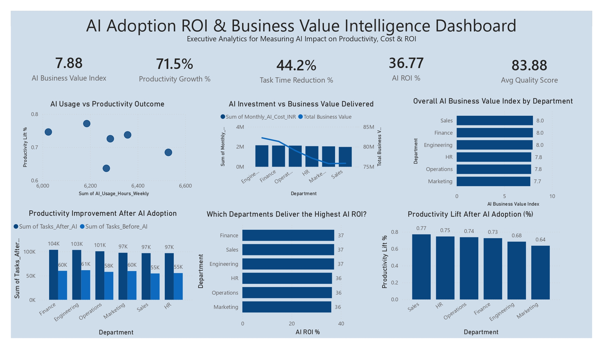

# AI Adoption ROI & Business Value Intelligence Dashboard

## Overview

The AI Adoption ROI & Business Value Intelligence Dashboard is an executive-level Power BI solution designed to measure the effectiveness of Artificial Intelligence initiatives across business departments. The dashboard provides actionable insights into AI-driven productivity improvements, operational efficiency, cost optimization, quality enhancement, and return on investment (ROI).

By consolidating AI adoption metrics into a single view, decision-makers can evaluate the business value generated from AI investments and identify departments achieving the highest impact.

---

## Dashboard Preview

---

## Business Problem

Organizations increasingly invest in AI technologies but often struggle to quantify their business impact. Leadership teams require a data-driven approach to answer critical questions:

- Is AI improving employee productivity?
- How much operational time is being saved?
- Which departments generate the highest ROI from AI investments?
- Is AI delivering measurable business value?
- How does AI affect work quality and efficiency?

This dashboard addresses these challenges by transforming AI adoption data into meaningful business intelligence.

---

## Key Performance Indicators (KPIs)

| KPI | Description |
|------|-------------|
| AI Business Value Index | Overall score representing business value generated by AI |
| Productivity Growth (%) | Percentage increase in productivity after AI adoption |
| Task Time Reduction (%) | Reduction in time required to complete tasks |
| AI ROI (%) | Return generated from AI investments |
| Average Quality Score | Quality improvement achieved through AI usage |

---

## Dashboard Features

### 1. Executive KPI Summary
Provides a high-level overview of AI performance through:
- Business Value Index
- Productivity Growth
- Task Time Reduction
- AI ROI
- Average Quality Score

### 2. AI Usage vs Productivity Outcome
Analyzes the relationship between:
- AI usage hours
- Productivity improvements

Helps identify whether increased AI utilization translates into higher productivity.

### 3. AI Investment vs Business Value Delivered
Compares:
- Monthly AI investment costs
- Business value generated

Enables evaluation of AI investment efficiency across departments.

### 4. Department-wise Business Value Index
Ranks departments based on:
- Overall AI-generated business value

Supports strategic investment decisions.

### 5. Productivity Improvement Analysis
Compares:
- Tasks completed before AI adoption
- Tasks completed after AI adoption

Demonstrates operational gains achieved through AI implementation.

### 6. Department-wise AI ROI Analysis
Highlights departments delivering:
- Highest AI ROI
- Strongest financial returns from AI initiatives

### 7. Productivity Lift Analysis
Measures:
- Percentage productivity improvement by department

Identifies areas where AI adoption has been most successful.

---

## Technologies Used

- Power BI
- Microsoft Excel
- DAX (Data Analysis Expressions)
- Data Modeling
- Data Visualization

---

## Dataset Information

The dataset contains simulated enterprise AI adoption metrics including:

- Department
- AI Usage Hours
- Monthly AI Cost
- Tasks Completed Before AI
- Tasks Completed After AI
- Productivity Lift
- Time Reduction Percentage
- Quality Scores
- Business Value Generated

---

## Key Insights

- Significant productivity growth observed after AI adoption.
- Departments with higher AI utilization generally achieve greater productivity gains.
- AI implementation contributes to substantial task time reduction.
- Positive ROI demonstrates the financial viability of AI investments.
- Business value generation varies across departments, enabling targeted optimization strategies.

---

## Business Impact

This dashboard helps organizations:

- Measure AI adoption success
- Quantify ROI from AI investments
- Monitor productivity improvements
- Optimize AI spending
- Identify high-performing departments
- Support executive decision-making with data-driven insights

---

## Future Enhancements

- Real-time AI adoption monitoring
- Predictive ROI forecasting
- AI maturity assessment framework
- Employee adoption analytics
- Cost-benefit simulation models
- Department performance benchmarking
